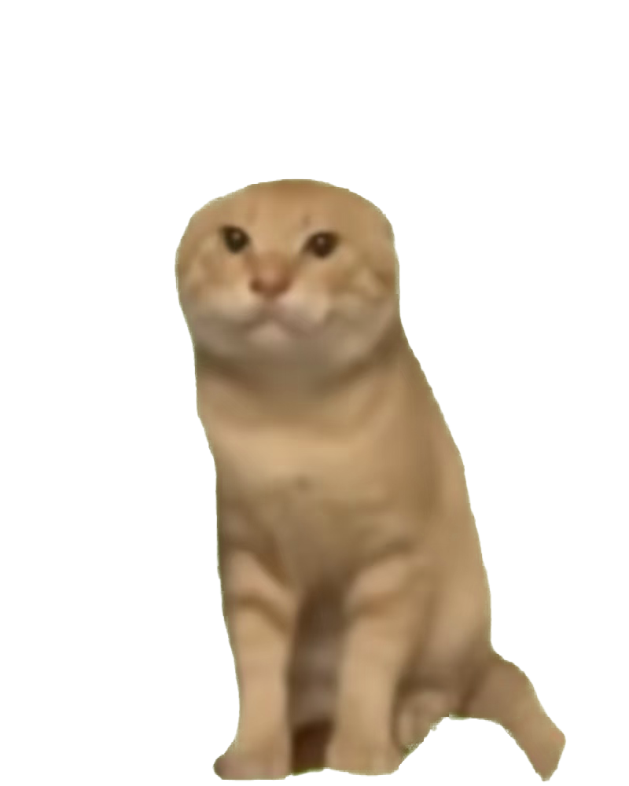

# 猫咪哈气闹钟

这是我的第一个项目，主要作用是设置一个有目的闹钟，有定时功能，能够看到距离目标还剩的时间，可以自己设定音乐，但是它是一只坏猫，不要尝试去点击它。

This is my first project. The main function is to set a purposeful alarm clock with timing function. You can see the time left from the target. You can set music by yourself. However, it is a bad cat. Don't try to click it.

一只住在桌面上的耄耋，陪你数着时间过日子。

基于 Electron 的 Windows 桌面宠物闹钟，无边框透明窗口，常驻屏幕角落。



## 功能特性

- **桌面宠物**：透明无边框窗口，猫咪趴在屏幕角落，不挡工作
- **点击互动**：点击猫咪会哈气（表情 + 音效 + 弹跳动画）
- **时钟气泡**：头顶悬浮当前时间
- **倒计时气泡**：自动显示距离下一个闹钟还有多久（每 12 秒闪现一次，鼠标悬停猫咪也会显示）
- **多闹钟管理**：支持多个闹钟，可设置时间、目的标签（起床 / 喝水 / 吃药…）
- **重复规则**：每天 / 仅一次 / 每周（可选星期几）
- **自定义铃声**：内置铃声，或从本地导入音频（mp3 / wav / ogg / m4a / aac / flac），支持试听、重命名、删除
- **音量渐强**：铃声从小到大逐渐升高（30～180 秒可调），不会吓人一跳
- **起床挑战**：响铃时需拍打猫咪 N 次才能停止，防止赖床
- **稍后提醒**：5 / 10 / 15 / 30 分钟贪睡
- **托盘常驻**：系统托盘图标，可隐藏 / 显示猫咪、打开设置、退出
- **自由调节**：按住拖动位置，拖动左上角手柄缩放大小，自动限制不超出屏幕
- **开机自启**：安装版支持登录系统后自动运行

## 快速开始

### 环境要求

- Windows 10 / 11
- [Node.js](https://nodejs.org/) ≥ 18

### 安装与运行

```bash
# 克隆仓库
git clone https://github.com/你的用户名/cat-hiss-alarm.git
cd cat-hiss-alarm

# 安装依赖
npm install

# 启动应用
npm start
```

或者直接双击项目根目录的 `启动猫咪闹钟.bat`。

### 打包安装程序

```bash
npm run dist
```

打包产物在 `dist/` 目录：

- `猫咪哈气闹钟 Setup 1.0.0.exe` — 安装版（可选安装目录，支持开机自启）
- `猫咪哈气闹钟 1.0.0.exe` — 免安装便携版

## 使用说明

| 操作 | 效果 |
| --- | --- |
| 左键点击猫咪 | 哈气（表情 + 音效） |
| 按住猫咪拖动 | 移动位置 |
| 按住左上角手柄拖动 | 缩放大小 |
| 鼠标悬停猫咪 | 显示倒计时气泡 |
| 右键猫咪 | 弹出菜单（设置 / 隐藏 / 重置大小 / 重置位置 / 退出） |
| 托盘图标左键 | 显示 / 隐藏猫咪 |
| 托盘图标右键 | 托盘菜单 |

闹钟设置窗口支持新增、编辑、删除闹钟，以及导入自定义铃声。

## 项目结构

```
cat-hiss-alarm/
├── main.js            # Electron 主进程（窗口管理、闹钟调度、托盘、IPC）
├── preload.js         # 渲染进程桥接 API
├── index.html         # 桌面宠物窗口
├── pet.js             # 宠物渲染逻辑（布局、命中检测、拖拽缩放）
├── pet.css            # 宠物样式
├── settings.html      # 闹钟设置窗口
├── settings.js        # 设置窗口逻辑
├── alarm.html         # 响铃窗口
├── alarm.js           # 响铃窗口逻辑（挑战拍打、贪睡）
├── assets/            # 图片 / 音频素材
├── build/             # 打包图标
├── scripts/
│   ├── start.js       # npm start 启动器
│   └── gen-alarm.js   # 生成内置铃声 alarm.wav
└── package.json
```

## 技术要点

- 三个独立 `BrowserWindow`：宠物、设置、响铃，均为无边框透明、置顶（screen-saver 层级）
- 命中检测：渲染进程将猫咪 PNG 的 alpha 通道采样成网格，鼠标穿透只作用于透明区域，点击精确到猫的轮廓
- 拖动跟随：主进程每 16ms 读取系统光标位置驱动窗口，快速拖动不脱轨
- 单实例锁：重复启动时唤醒已存在的猫咪
- 数据持久化：设置保存在 `userData/settings.json`，导入的音频保存在 `userData/library/`

## License

[MIT](LICENSE)
